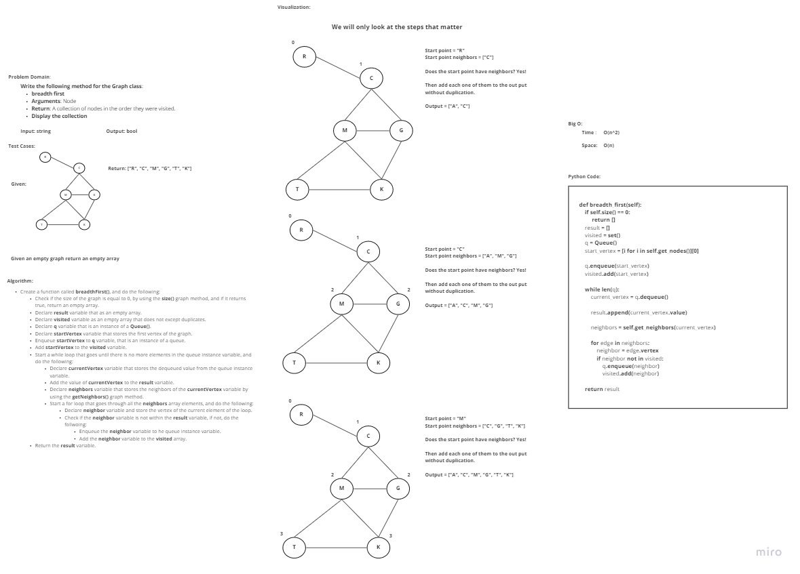

# Challenge Summary
<!-- Description of the challenge -->
**Write the following method for the Graph class**:

- breadth first
  - Arguments: Node
  - Return: A collection of nodes in the order they were visited.
  - Display the collection

## Whiteboard Process
<!-- Embedded whiteboard image -->

## Approach & Efficiency
<!-- What approach did you take? Why? What is the Big O space/time for this approach? -->
I took an iterative approach, as for the Big O:
- **Time**: O(n^2)
- **Space**: O(n)

## Solution
<!-- Show how to run your code, and examples of it in action -->

In order to run the code enter "**python .\Data_Structures_Challenges\graph_breadth_first\graph_breadth_first.py**"

In order to run the tests enter "**pytest .\Data_Structures_Challenges\graph_breadth_first\tests\test_graph_breadth_first.py**"
