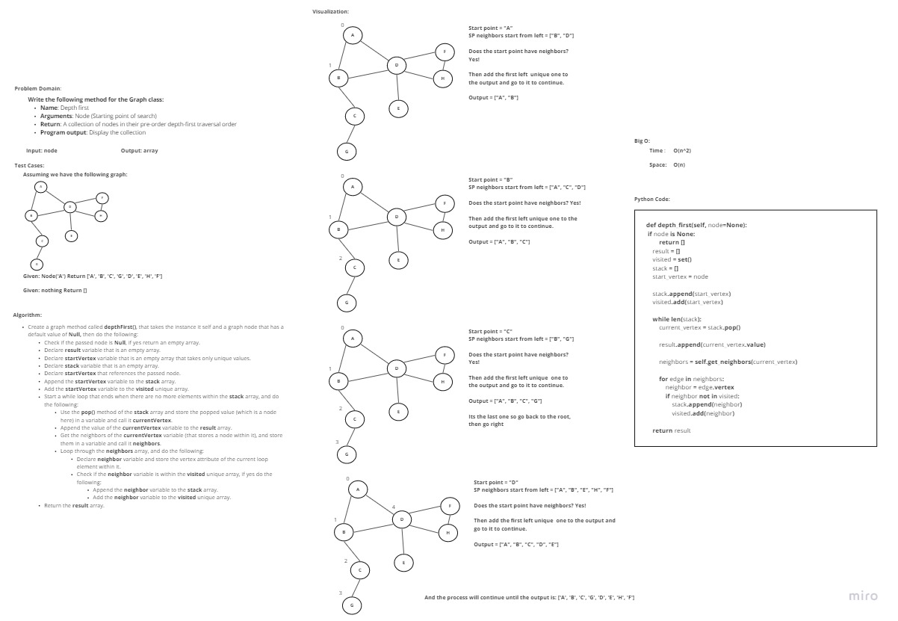

# Depth First Traversal
<!-- Short summary or background information -->
**Depth first is a graph traversal technique that uses one of the following:**
- pre-order
- in-order
- post-order

## Challenge
<!-- Description of the challenge -->
**Write the following method for the Graph class:**

- Name: Depth first
- Arguments: Node (Starting point of search)
- Return: A collection of nodes in their pre-order depth-first traversal order
- Program output: Display the collection

## Approach & Efficiency
<!-- What approach did you take? Why? What is the Big O space/time for this approach? -->
I took an iterative approach, the traversal technique used is pre-order, as for the Big O:
- **Time**: O(n^2)
- **Space**: O(n)

## Solution
<!-- Embedded whiteboard image -->

## How to run:

In order to run the code enter "**python .\Data_Structures_Challenges\graph_depth_first\graph_depth_first.py**"

In order to run the tests enter "**pytest .\Data_Structures_Challenges\graph_depth_first\tests\test_graph_depth_first.py**"
