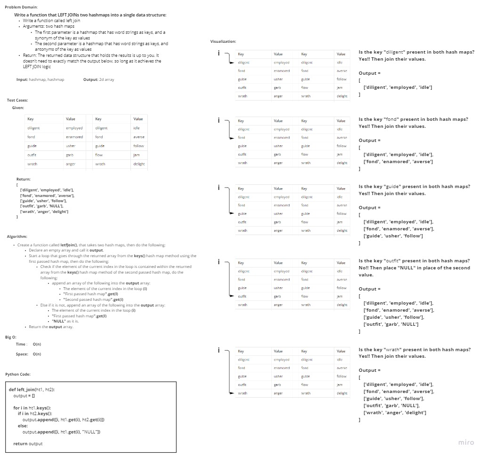

# Hashmap LEFT JOIN
<!-- Short summary or background information -->
Left Join is a term used in databases, which means comparing two tables and joining them by the left table attributes 
even if there were no matches in the right table

## Challenge
<!-- Description of the challenge -->
**Write a function that LEFT JOINs two hashmaps into a single data structure.**

- Write a function called left join
- Arguments: two hash maps
  - The first parameter is a hashmap that has word strings as keys, and a synonym of the key as values.
  - The second parameter is a hashmap that has word strings as keys, and antonyms of the key as values.
- Return: The returned data structure that holds the results is up to you. It doesn’t need to exactly match the output below, so long as it achieves the LEFT JOIN logic

## Approach & Efficiency
<!-- What approach did you take? Why? What is the Big O space/time for this approach? -->
I took an iterative approach, as for the Big O:
- **Time**: O(n) as there is a liner iteration involved.
- **Space**: O(n) because of the array that has been created to store the returned output.

## Solution
<!-- Embedded whiteboard image -->

