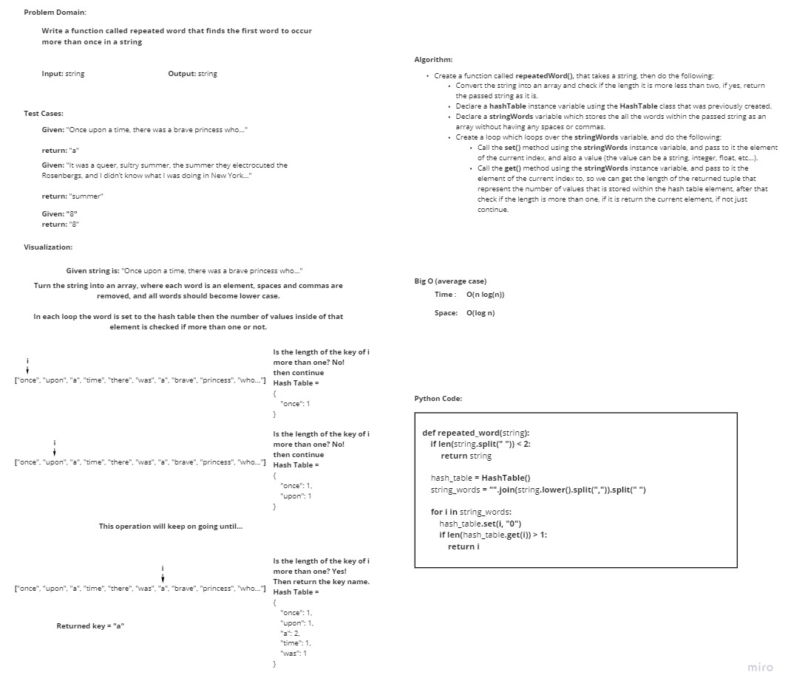

# Challenge Summary
<!-- Description of the challenge -->
**Write a function called repeated word that finds the first word to occur more than once in a string**
- Arguments: string
- Return: string

***Note***: this solution is built upon the [previous hash table functions](../hashtable/README.md)

## Whiteboard Process
<!-- Embedded whiteboard image -->

## Approach & Efficiency
<!-- What approach did you take? Why? What is the Big O space/time for this approach? -->
I took an iterative approach, as for the Big O:

- **Time**: O(n) as there is a loop that goes through the words within the string.
- **Space**: O(n) as there is some extra space, because an array and a hashtable were created.

## Solution
<!-- Show how to run your code, and examples of it in action -->

In order to run the code enter "**python .\Data_Structures_Challenges\hashmap_repeated_word\hashmap_repeated_word.py**"

In order to run the tests enter "**pytest .\Data_Structures_Challenges\hashmap_repeated_word\tests\test_hashmap_repeated_word.py**"
