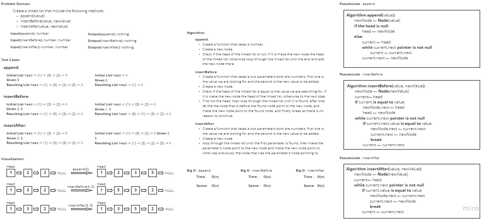

# Challenge Summary
<!-- Description of the challenge -->
Write the following methods for the Linked List class:

**append**

    arguments: new value
    adds a new node with the given value to the end of the list

**insert before**

    arguments: value, new value
    adds a new node with the given new value immediately before the first node that has the value specified

**insert after**

    arguments: value, new value
    adds a new node with the given new value immediately after the first node that has the value specified

After that write tests that include: 
- Can successfully add a node to the end of the linked list
- Can successfully add multiple nodes to the end of a linked list
- Can successfully insert a node before a node located i the middle of a linked list
- Can successfully insert a node before the first node of a linked list
- Can successfully insert after a node in the middle of the linked list
- Can successfully insert a node after the last node of the linked list

## Whiteboard Process
<!-- Embedded whiteboard image -->

## Approach & Efficiency
<!-- What approach did you take? Why? What is the Big O space/time for this approach? -->
I took a linear iterative approach for these methods as it's the fastest best approach.

As for the Big O time and space complexity it is the same for all three methods:
- **Time**: O(n)
- **Space**: O(n)

## Solution
<!-- Show how to run your code, and examples of it in action -->
In order to start the methods use the command "**python .\linked_list_insertions\linked_list_insertions.py**"

In order to start the tests use the command "**pytest .\linked_list_insertions\tests\test_linked_list_insertions.py**"
