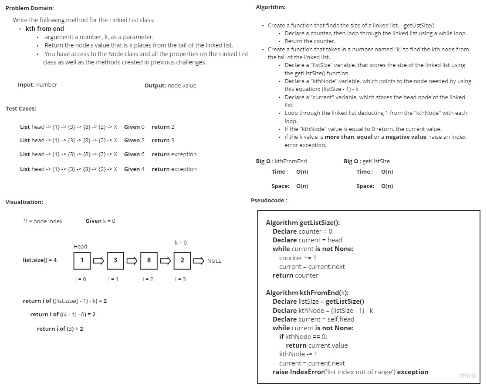

# Challenge Summary
<!-- Description of the challenge -->
Write the following method for the Linked List class:

- **kth from end**
  - argument: a number, k, as a parameter.
  - Return the node’s value that is k places from the tail of the linked list.
  - You have access to the Node class and all the properties on the Linked List class as well as the methods created in previous challenges.

Write tests for the following scenarios:
- Where k is greater than the length of the linked list
- Where k and the length of the list are the same
- Where k is not a positive integer
- Where the linked list is of a size 1
- “Happy Path” where k is not at the end, but somewhere in the middle of the linked list

## Whiteboard Process
<!-- Embedded whiteboard image -->

## Approach & Efficiency
<!-- What approach did you take? Why? What is the Big O space/time for this approach? -->
I took a linear iterative approach for these methods as it's the fastest best approach.

As for the Big O time and space complexity for the kth_from_end method:
- **Time**: O(n)
- **Space**: O(n)

## Solution
<!-- Show how to run your code, and examples of it in action -->
In order to start the methods use the command "**python .\linked_list_kth\linked_list_kth.py**"

In order to start the tests use the command "**pytest .\linked_list_kth\tests\test_linked_list_kth.py**"
