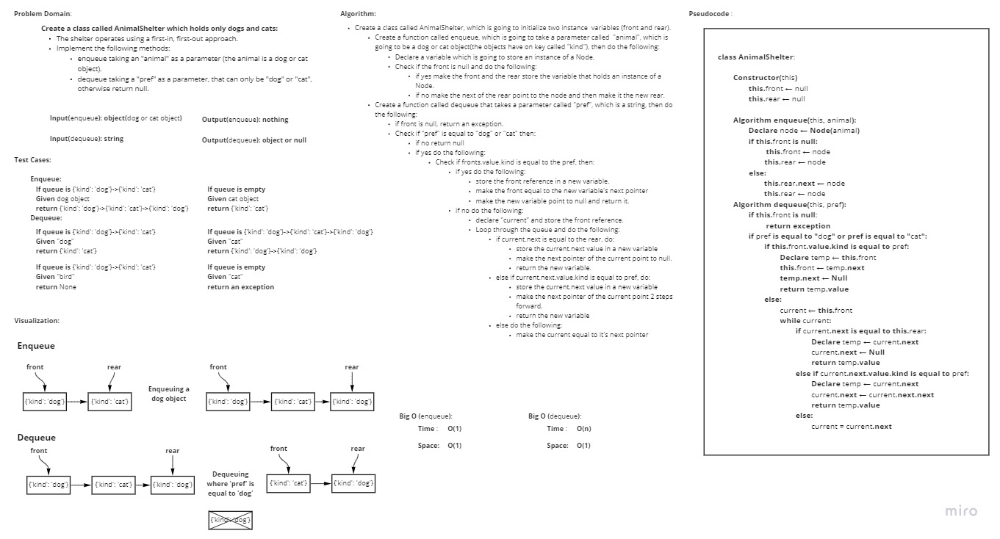

# Challenge Summary
<!-- Description of the challenge -->
**Create a class called AnimalShelter which holds only dogs and cats.**
- The shelter operates using a first-in, first-out approach.
- Implement the following methods:

    - enqueue
        
        - Arguments: animal

            - animal can be either a dog or a cat object

    - dequeue

        - Arguments: pref

            - pref can be either "dog" or "cat"

        - Return: either a dog or a cat, based on preference

            - If pref is not "dog" or "cat" then return null.

## Whiteboard Process
<!-- Embedded whiteboard image -->

## Approach & Efficiency
<!-- What approach did you take? Why? What is the Big O space/time for this approach? -->
I took the FIFO approach, and a liner iterative approach to reach the best possible Time and Space complexity.

Speaking of the Time and Space complexity, here they are for both methods:
- **enqueue**
    
    - **Time**: O(1)
    - **Space**: O(1)

- **dequeue**
    
    - **Time**: O(n)
    - **Space**: O(1)

## Solution
<!-- Show how to run your code, and examples of it in action -->

In order to run the code use the command "**python .\stack_queue_animal_shelter\stack_queue_animal_shelter.py**"

In order to run the tests use the command "**pytest .\stack_queue_animal_shelter\tests\test_stack_queue_animal_shelter.py**"