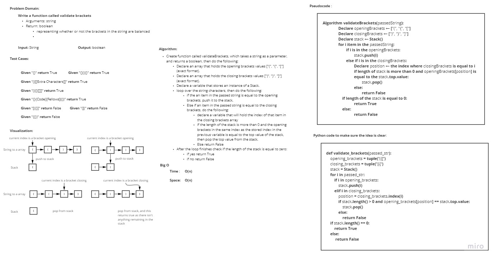

# Challenge Summary
<!-- Description of the challenge -->
- **Write a function called validate brackets**:

    - Arguments: string
    - Return: boolean
        - representing whether or not the brackets in the string are balanced

## Whiteboard Process
<!-- Embedded whiteboard image -->

## Approach & Efficiency
<!-- What approach did you take? Why? What is the Big O space/time for this approach? -->
I took a linear Iterative approach for better performance, as for the Big O notation:
- **Time**: O(n)
- **Space**: O(n)

## Solution
<!-- Show how to run your code, and examples of it in action -->

In order to run the code run the command "**python .\stack_queue_brackets\stack_queue_brackets.py**"

In order to run the tests run the command "**pytest .\stack_queue_brackets\tests\test_stack_queue_brackets.py**"