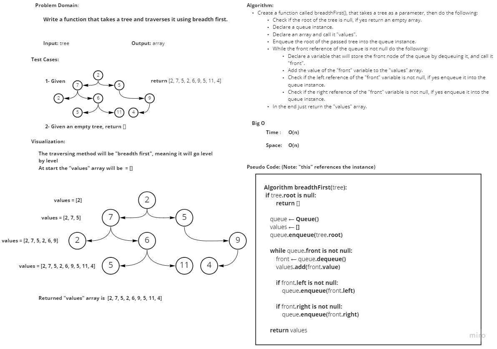

# Challenge Summary
<!-- Description of the challenge -->
- **Write a function called breadth first**
  - Arguments: tree
  - Return: list of all values in the tree, in the order they were encountered

## Whiteboard Process
<!-- Embedded whiteboard image -->

## Approach & Efficiency
<!-- What approach did you take? Why? What is the Big O space/time for this approach? -->
I took an iterative approach, as for the Big O:
- **Time**: O(n)
- **Space**: O(n)

## Solution
<!-- Show how to run your code, and examples of it in action -->

In order to run the code enter "**python .\tree_breadth_first\tree_breadth_first.py**"

In order to test the code enter "**pytest .\tree_breadth_first\tests\test_tree_breadth_first.py**"
