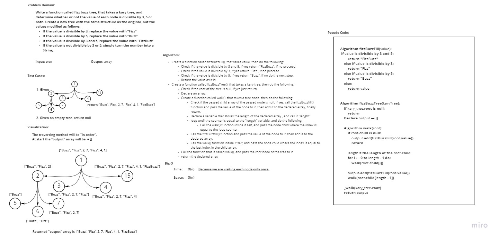

# Challenge Summary
<!-- Description of the challenge -->
**Write a function called fizz buzz tree**
- Arguments: k-ary tree
- Return: new k-ary tree
- Determine whether or not the value of each node is divisible by 3, 5 or both. Create a new tree with the same structure as the original, but the values modified as follows:

  - If the value is divisible by 3, replace the value with “Fizz”
  - If the value is divisible by 5, replace the value with “Buzz”
  - If the value is divisible by 3 and 5, replace the value with “FizzBuzz”
  - If the value is not divisible by 3 or 5, simply turn the number into a String.

## Whiteboard Process
<!-- Embedded whiteboard image -->

## Approach & Efficiency
<!-- What approach did you take? Why? What is the Big O space/time for this approach? -->
I took a recursive approach, as for the Big O:

- for the `fizz_buzz_fill()` function:
  - **Time**: O(1)
  - **Space**: O(1)

- for the `fizz_buzz_tree()` function:
  - **Time**: O(n), **Because we are visiting each node only once.**
  - **Space**: O(n)

## Solution
<!-- Show how to run your code, and examples of it in action -->

In order to run the code enter "**python .\tree_fizz_buzz\tree_fizz_buzz.py**"

In order to run the tests enter "**pytest .\tree_fizz_buzz\tests\test_tree_fizz_buzz.py**"
