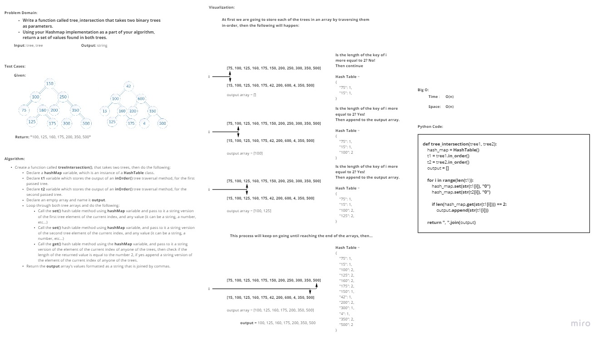

# Challenge Summary
<!-- Description of the challenge -->
- **Write a function called tree_intersection that takes two binary trees as parameters.**
- **Using your Hashmap implementation as a part of your algorithm, return a set of values found in both trees.**

## Whiteboard Process
<!-- Embedded whiteboard image -->

## Approach & Efficiency
<!-- What approach did you take? Why? What is the Big O space/time for this approach? -->
I took an iterative approach, as for the Big O:

- **Time**: O(n) as there is a loop over both trees.
- **Space**: O(n) as there has been some extra space added in the form of three arrays and one hash map.

## Solution
<!-- Show how to run your code, and examples of it in action -->

In order to run the code enter "**python .\Data_Structures_Challenges\tree_intersection\tree_intersection.py**"

In order to run the tests enter "**pytest .\Data_Structures_Challenges\tree_intersection\tests\test_tree_intersection.py**"
