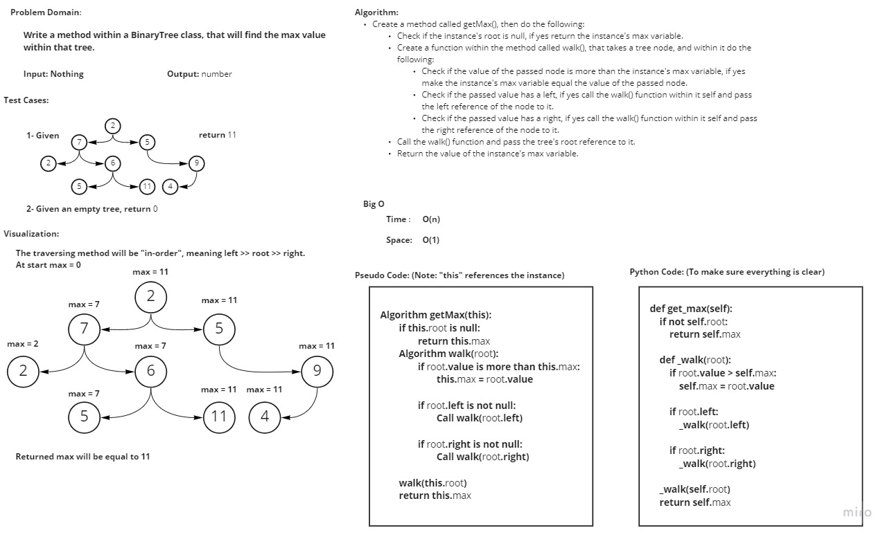

# Challenge Summary
<!-- Description of the challenge -->
**Write the following method for the Binary Tree class**

- find maximum value
  - Arguments: none
  - Returns: number

## Whiteboard Process
<!-- Embedded whiteboard image -->

## Approach & Efficiency
<!-- What approach did you take? Why? What is the Big O space/time for this approach? -->
I took a recursive approach with the following Big O (_for the get_max() method_):
- **Time**: O(n)
- **Space**: O(1)

## Solution
<!-- Show how to run your code, and examples of it in action -->

In order to run the code enter "**python .\tree_max\tree_max.py**"

In order to run the tests enter "**pytest .\tree_max\tests\test_tree_max.py**"