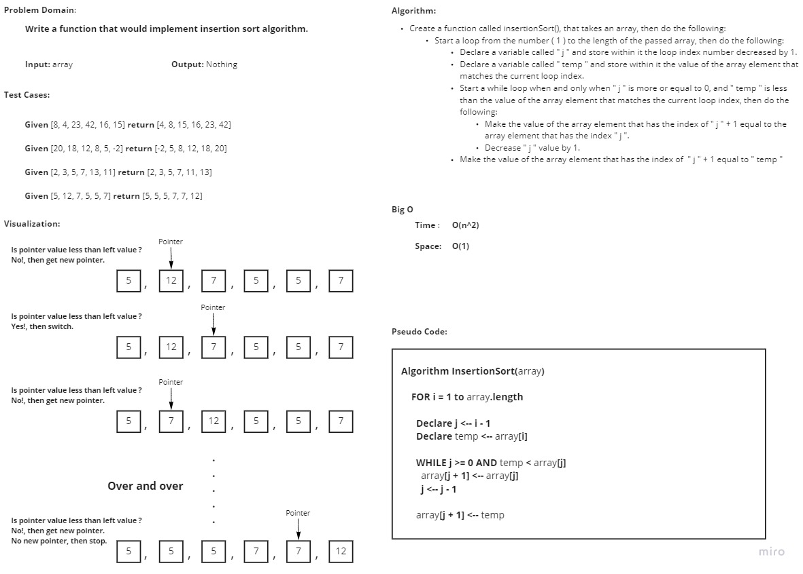

# Challenge Summary
<!-- Description of the challenge -->
Write a function that would implement insertion sort algorithm.

## Whiteboard Process
<!-- Embedded whiteboard image -->

## Approach & Efficiency
<!-- What approach did you take? Why? What is the Big O space/time for this approach? -->
I took an iterative approach, as for Big O:

- **Time**: O(n^2)
- **Space**: O(1)

## Solution
<!-- Show how to run your code, and examples of it in action -->

In order to run the code enter "**python .\Sorting\insertion\insertion.py**"

In order to run the tests enter "**pytest .\Sorting\insertion\tests\test_insertion.py**"
