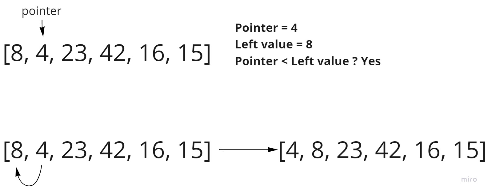
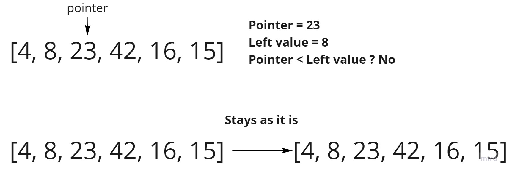
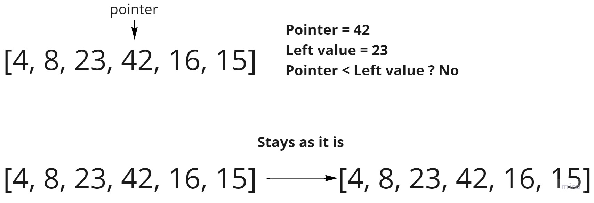
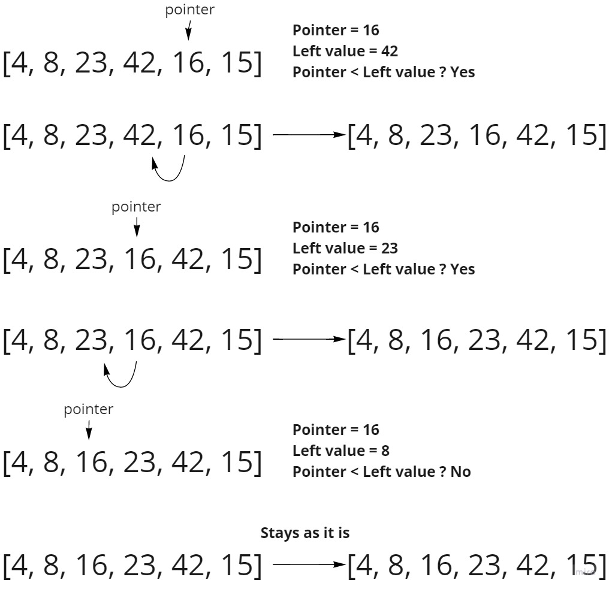
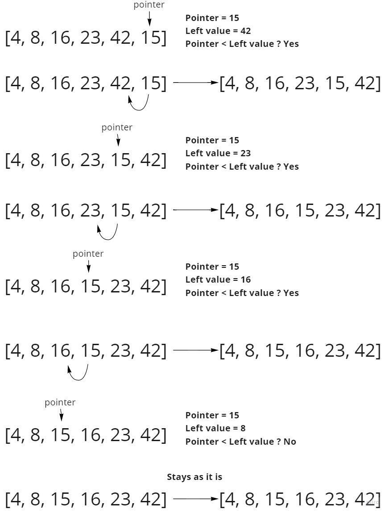

# Insertion Sort

Insertion sort is a sorting algorithm that places each element at its suitable place in each iteration, to reach a fully sorted array.

### Pseudocode

      InsertionSort(int[] arr)

        FOR i = 1 to arr.length
    
          int j <-- i - 1
          int temp <-- arr[i]
    
          WHILE j >= 0 AND temp < arr[j]
            arr[j + 1] <-- arr[j]
            j <-- j - 1
    
          arr[j + 1] <-- temp

### Trace

Sample Array: `[8,4,23,42,16,15]`

In each iteration we should pick a pointer, in the first one it will be the value of index 1, because we need to 
compare it to the value to it's left which is the value of index 0, after that in each iteration we will be 
going to take the pointer index + 1 as a new pointer, so lets start tracing:

#### Iteration #1:

In the first iteration we look if the pointer (value of index 1) value is less than the value to it's left
(value of index 0), if yes we will swap them and in this iteration the pointer was less than the left value, 
so they have been swapped. 

#### Iteration #2:

In this iteration we will take the pointer index + 1 as a new pointer, and compare it to it's left value, which in
this iteration isn't less than the pointer, meaning we will change nothing and go for the next iteration as the
elements we have checked until now are sorted.

#### Iteration #3:

In this iteration we will get the next pointer and compare again, and as you can see the pointer isn't less than 
the value to it's left, so we will go to the next iteration.

#### Iteration #4:

In this iteration the pointer is less than the left value, so we have swapped them, and after checking the new left
value we found that the pointer is also less than the new left value, so we will swap again, then after checking
again we found that the left value isn't less than the pointer, so we will stop and go to the next iteration.

#### Iteration #5:

At this iteration the pointer reached to the last element, so this is the last iteration, and we found that the 
pointer is less than the left value in it's first, second, and third inner iteration, so we will swap with each one
of them until we reach the 4th inner iteration where the pointer is no longer less than the left value, and thats 
where we will stop as there is no more elements to go over and the loop has reached it's break condition.

### Efficiency

- **Time**: O(n^2) as we have used nested loops, which would mean that there is an inner iteration for each iteration.
- **Space**: O(1) as we have not used any extra space, the sorting is happening for the array in place.
