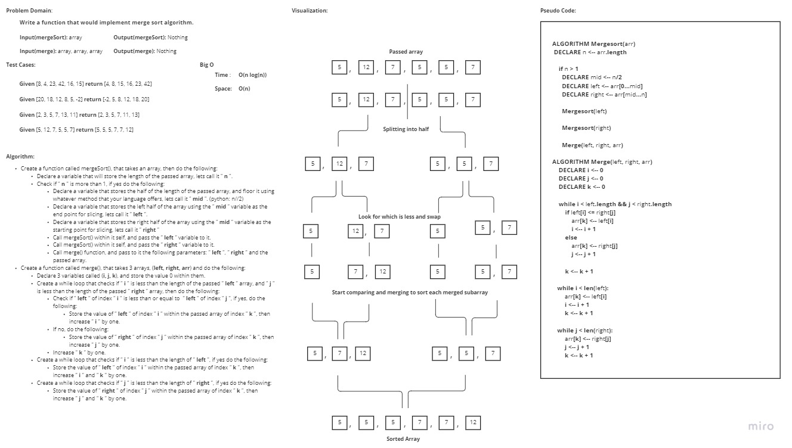

# Challenge Summary
<!-- Description of the challenge -->
Write a function that would implement merge sort algorithm.

## Whiteboard Process
<!-- Embedded whiteboard image -->

## Approach & Efficiency
<!-- What approach did you take? Why? What is the Big O space/time for this approach? -->
I took an approach that uses recursion and iterations, as for Big O:

- **Time**: O(n log(n)) as mergesort always divides the array into two halves and takes linear time to merge the two of them.
- **Space**: O(n)

## Solution
<!-- Show how to run your code, and examples of it in action -->

In order to run the code enter "**python .\Sorting\merge\merge.py**"

In order to run the tests enter "**pytest .\Sorting\merge\tests\test_merge.py**"
