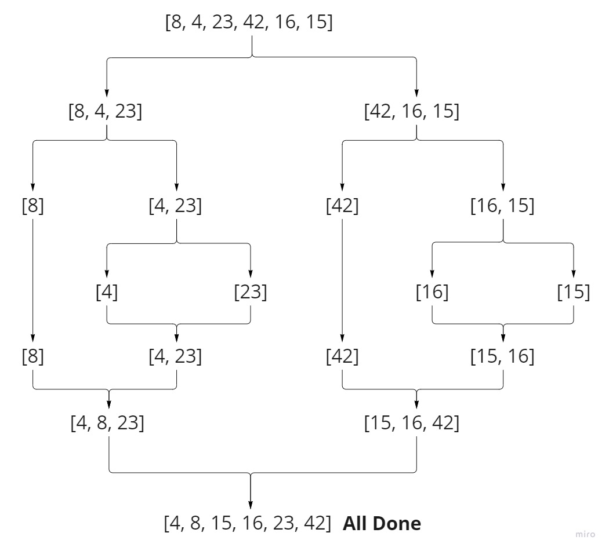

# Insertion Sort

Merge sort is a comparison-based sorting algorithm, that places each element at its suitable place by splitting the 
array over and over until it becomes small units that are easy to compare.

### Pseudocode

      ALGORITHM Mergesort(arr)
     DECLARE n <-- arr.length
    
        if n > 1
          DECLARE mid <-- n/2
          DECLARE left <-- arr[0...mid]
          DECLARE right <-- arr[mid...n]
          
          Mergesort(left)
          
          Mergesort(right)
          
          Merge(left, right, arr)

    ALGORITHM Merge(left, right, arr)
        DECLARE i <-- 0
        DECLARE j <-- 0
        DECLARE k <-- 0
    
        while i < left.length && j < right.length
            if left[i] <= right[j]
                arr[k] <-- left[i]
                i <-- i + 1
            else
                arr[k] <-- right[j]
                j <-- j + 1
    
            k <-- k + 1
    
       while i < len(left):
            arr[k] <-- left[i]
            i <-- i + 1
            k <-- k + 1
    
       while j < len(right):
            arr[k] <-- right[j]
            j <-- j + 1
            k <-- k + 1

### Trace

Sample Array: `[8,4,23,42,16,15]`

For this sorting algorithm we are going to be using mainly recursion, so we are going to be tracing
recursion steps for the function, and according to the code we are always going to start from the left,
so lets start:

**Note**: Once the size of the subarray becomes 1, the merge processes come into action and start 
merging arrays back till the complete array is merged.

#### Step #1:

This step is the general rule, whenever the length of the array is more than 1, that means we are going to split.

#### Step #2:

In this step we have taken the left half of the original array, as just like I have mentioned before the function
will always call itself on the left half of the array first, and as you can see the array is more than 1 so we are
splitting it again.

#### Step #3:

Here we can see that the new sub array have only one element, and that calls for merge, but as we have nothing to compare
and merge it will remain the same.

#### Step #4:

So because we are done with the left side in the last step, we are going now for the right side, and the new 
sub array is more than 1, which means we are going to split

#### Step #5:

Here we are going to perform 2 steps, which are checking the number of elements on the left and right, and because 
they are both not more than 1, that means that we are going to compare, sort and merge.

#### Step #6:

Here we are done with both sides, so we are going to compare, sort and merge.

#### Step #7:

#### Step #8:

As we are done with the left side in the previous steps, now its time to go for the right side, starting with getting 
the right half of the original array as a sub array, and because it is more than 1, we need to split it.

#### Step #9:

As usual we start from the left, and because the new sub array have one element, we call the merge and nothing change 
because there is only one element.

#### Step #10:

To the right side we go and there are to elements, meaning we need to split.

#### Step #11:

After splitting, we can see again that its time for the two steps of checking the number of elements, and after 
that we compare, sort and merge.

#### Step #12:

And here we are done with both sides, so we are going to compare, sort and merge both sides.

#### Step #13:

#### Step #14:

And now its time for the final step which is comparing, sorting and merging the results of both sides, to get 
the final result, which is what we need.

### Efficiency

- **Time**: O(n log(n)) as mergesort always divides the array into two halves and takes linear time to merge the two of them.
- **Space**: O(n) as we have used some extra space, which is the left and right sub arrays.
