# Quick Sort

Quick sort is in-place sorting algorithm, that places each element at its suitable place by using a pivot to compare 
and sort, to the left or right of it.

### Pseudocode

    ALGORITHM quickSort(arr, left, right)
        if left < right
            DECLARE position <-- partition(arr, left, right)
        
            quickSort(arr, left, position - 1)
        
            quickSort(arr, position + 1, right)

    ALGORITHM partition(arr, left, right)
        DECLARE pivot <-- arr[right]
        DECLARE low <-- left - 1
    
        for i <- left to right do
            if arr[i] <= pivot
                low++
                swap(arr, i, low)
    
        swap(arr, right, low + 1)
        return low + 1

    ALGORITHM swap(arr, i, low)
        DECLARE temp <-- arr[i]
        arr[i] <-- arr[low]
        arr[low] <-- temp

### Trace

Sample Array: `[8, 4, 23, 42, 16, 15]`

Let us start tracing step by step:

**Important Notes**: 
- At first the **right** variable is equal to `array.length - 1`, and the **left** variable is equal to `0`.
- The pivot is equal to `arr[right]`
- The value of the **low** variable always starts at **left** variable value - 1.
- The value of the **i** variable always **left** variable value.
- When `arr[i]` < the pivot, that means that we are going to increase the **low** variable by one, and that `arr[i]` and  `arr[low]` are going to get swapped.
- When the **i** variable is equal to the **right** variable, that means that the **low** variable will increase by one, and that the pivot and `arr[low]` are going to get swapped.

#### Step #1:

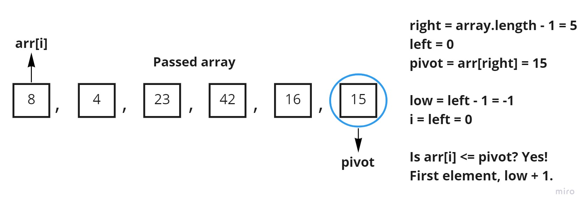

Here we started a new set of iterations to compare `arr[i]` to the pivot, and because the value of `arr[i]` 
is less than the pivot its going to get swapped, but because its the first element and **low** variable is still -1, 
we will go to the increase the **low** variable and go to the next iteration.

#### Step #2:

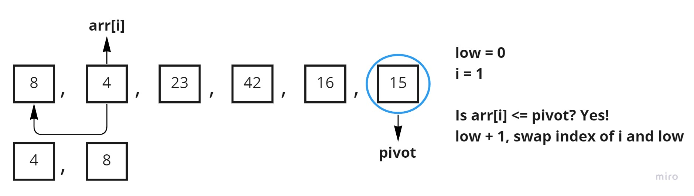

Here the `arr[i]` value is also less than the pivot, so we are just going to increase the **low** variable by one 
and swap the elements as shown, after that we go to the next iteration.

#### Step #3:

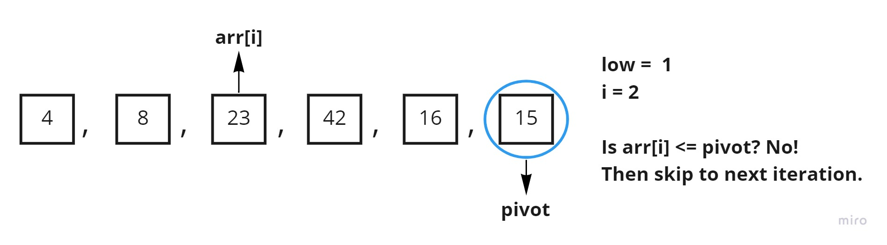

Here the value of `arr[i]` is more than the pivot so we skip to the next iteration.

#### Step #4:

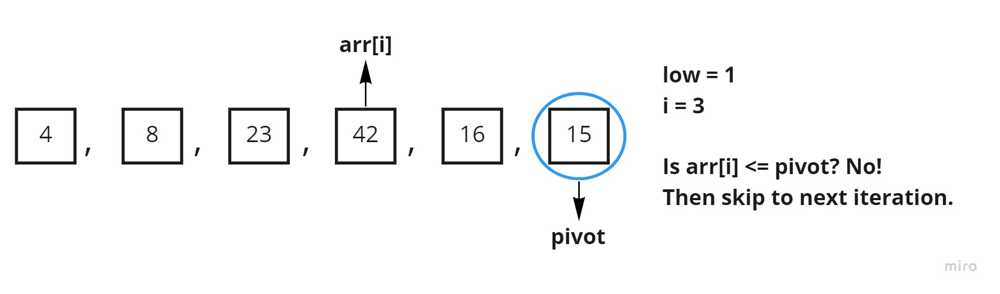

Same as before, to the next iteration

#### Step #5:

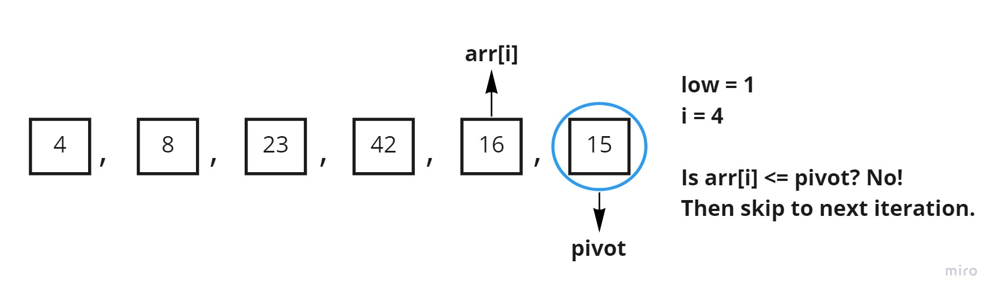

And again.

#### Step #6:

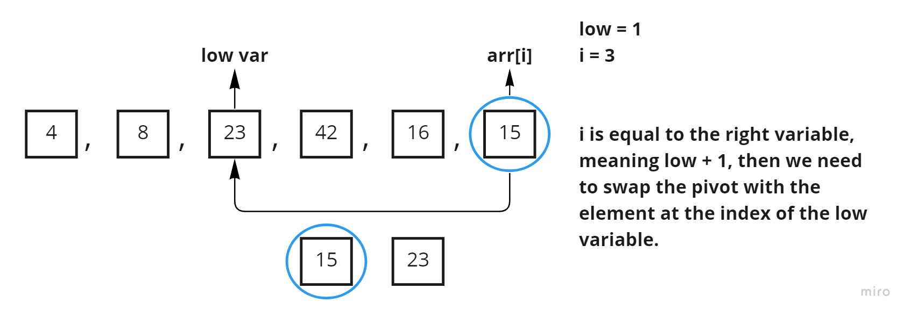

Here the **i** variable is equal to the **right** variable, so we are going to increase the **low** variable 
and swap elements as shown.

#### Step #7:

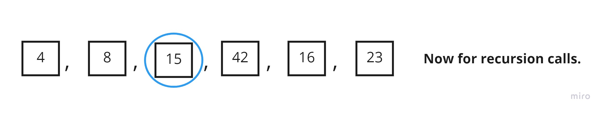

Start the previous process for the left and right of the pivot, let us start with the left first, just like the code 

#### Step #8:

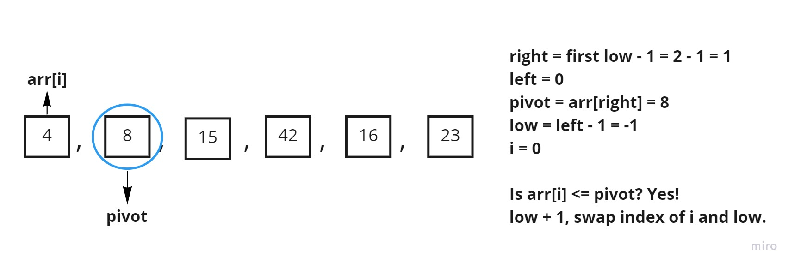

At this point the recursion calls start to work, and the first thing we do start sorting the left side from the first pivot, 
so the sorting method is called but this time we send `left = 0` and `right = the resulting low from the first set of iterations - 1`, 
but we are going to skip this side of the operation as it is already sorted and nothing is going to change.

#### Step #9:

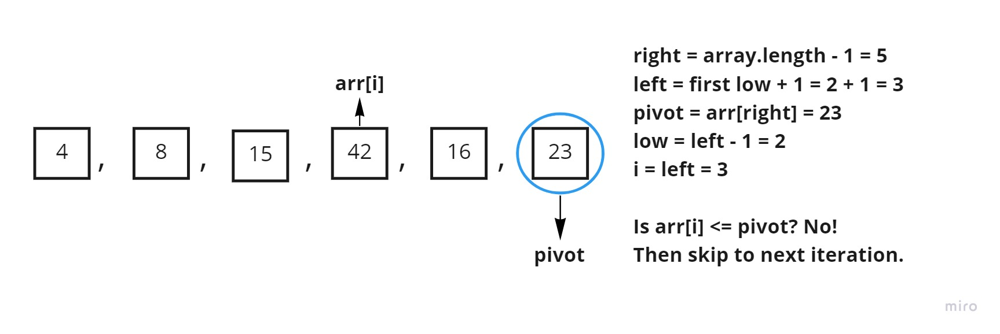

Now we are done with the left side, the sorting method will be called on the right side and will be given 
`left = the resulting low from the first set of iterations + 1` and `right = array.length - 1`, and as you can see 
we start to compare the pivot and `arr[i]` value, which is not less in this iteration, so we are skipping.

#### Step #10:

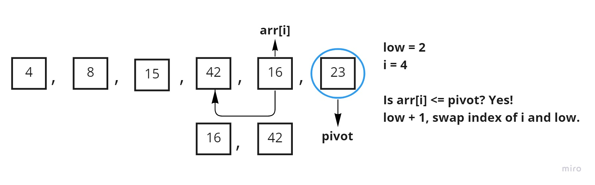

Here on the other side, the `arr[i]` value is less than the pivot, so we are going to swap, and go to the next iteration.

#### Step #11:

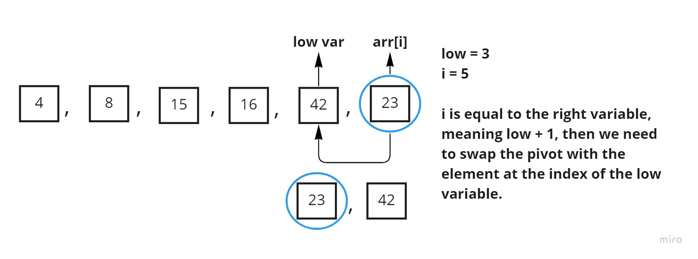

And because the **i** variable has reached the **right** variable, we are going to swap the pivot with the `arr[i]` value.

#### Step #12:

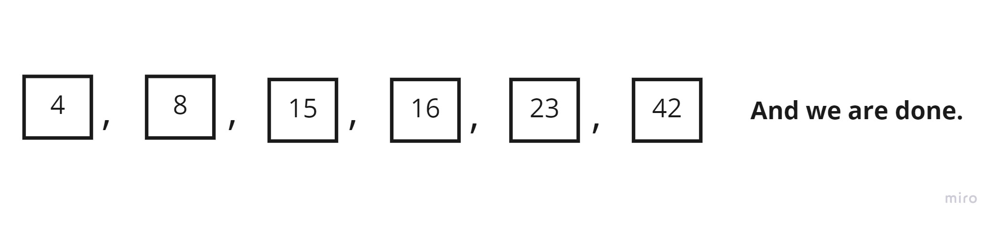

And just like that we have a sorted array, using the quick sort algorithm.

### Efficiency

- **Time**: O(n log(n)) as we divide the array into two halves at some point, and take linear time to go through them.
- **Space**: O(log(n)) as the space here is equal to the height of the recursion tree, which is O(log(n)).
