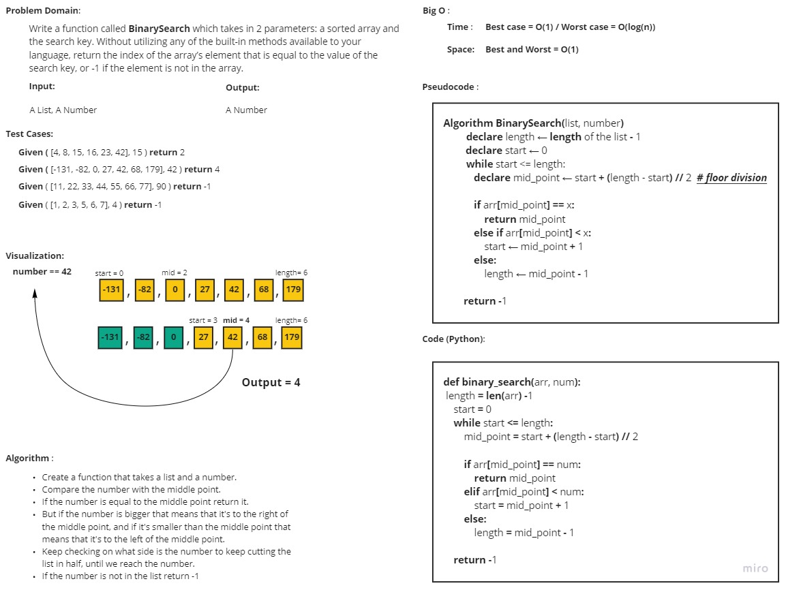

# Binary Search of Sorted Array
<!-- Description of the challenge -->
Write a function called **"BinarySearch"** which takes in 2 parameters: a sorted array and the search key. 
Without utilizing any of the built-in methods available to your language, return the index of the array’s 
element that is equal to the value of the search key, or -1 if the element is not in the array.

## Whiteboard Process
<!-- Embedded whiteboard image -->

## Approach & Efficiency
<!-- What approach did you take? Discuss Why. What is the Big O space/time for this approach? -->
I chose to go with the default way of **Binary Search** using **iteration** to achieve all the assignment requirements, 
because using **recursion** would have been a tid bit mor complicated.

For the approach, as I mentioned it's the default **binary search** approach, find the mid if the mid isn't the number,
cut the list in half according to the value of the mid, if the number is bigger cut the left, if it's smaller 
cut the right.

As for the **Big O space/time complexity**:
- **Time complexity** ==> Best Case = O(n), Worst Case = O(n^2)
- **Space complexity** ==> Best and Worst Case = O(1)