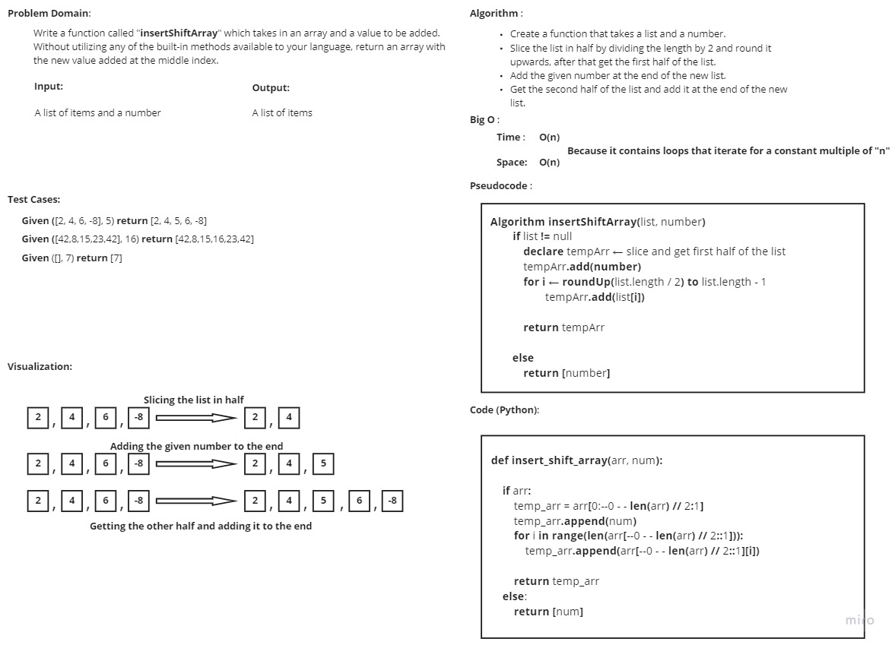

# Insert to Middle of an Array
<!-- Description of the challenge -->
Write a function called **"insertShiftArray"** which takes in an array and a value to be added. 
Without utilizing any of the built-in methods available to your language, return an array 
with the new value added at the middle index.

## Whiteboard Process
<!-- Embedded whiteboard image -->

## Approach & Efficiency
<!-- What approach did you take? Discuss Why. What is the Big O space/time for this approach? -->
I approach I took was to slice the given array in half, and store the first half in a new array, 
then I added the given number to the end of the new array, after that I added the second half of
the original array to the end of the new array.

As for the time and space complexity it is **O(n)**, because it contains loops that iterate for 
a constant multiple of "n"