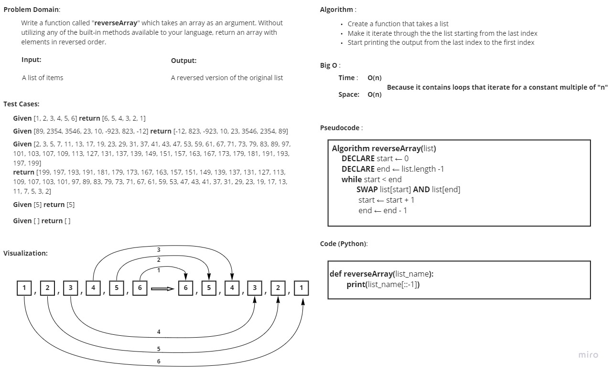

# Reverse an Array
<!-- Description of the challenge -->
Write a function called reverseArray which takes an array as an argument. 
Without utilizing any of the built-in methods available to your language, return an array with elements in reversed order.

## Whiteboard Process
<!-- Embedded whiteboard image -->

## Approach & Efficiency
<!-- What approach did you take? Discuss Why. What is the Big O space/time for this approach? -->
I used **extended slice syntax** in order to start printing from the last index item in the list to the first.

Extended slicing is considered a loop, which means in the current situation it has a time and space complexity of **O(n)**