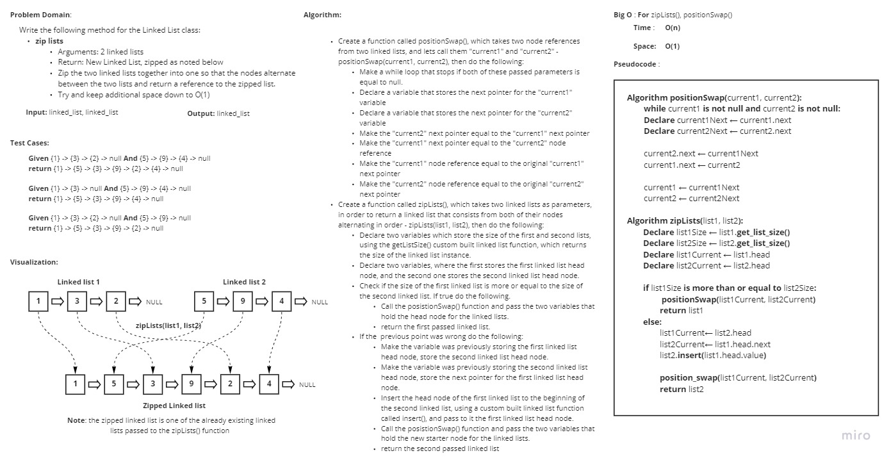

# Challenge Summary
<!-- Description of the challenge -->
**Write a function called zip lists**
- Arguments: 2 linked lists
- Return: New Linked List, zipped as noted below
- Zip the two linked lists together into one so that the nodes alternate between the two lists and return a reference to the zipped list.
- Try and keep additional space down to O(1)

## Whiteboard Process
<!-- Embedded whiteboard image -->

## Approach & Efficiency
<!-- What approach did you take? Why? What is the Big O space/time for this approach? -->
I took a linear iterative approach for these methods as it's the fastest best approach.

As for the Big O time and space complexity for the **zip_lists** method:
- **Time**: O(n)
- **Space**: O(1)

## Solution
<!-- Show how to run your code, and examples of it in action -->
In order to start the methods use the command "**python .\linked_list_zip\linked_list_zip.py**"

In order to start the tests use the command "**pytest .\linked_list_zip\tests\test_linked_list_zip.py**"