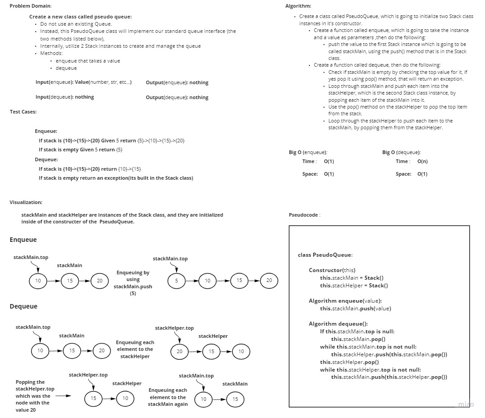

# Challenge Summary
<!-- Description of the challenge -->
- **Create a new class called pseudo queue**.

  - Do not use an existing Queue.
  - Instead, this PseudoQueue class will implement our standard queue interface (the two methods listed below),
  - Internally, utilize 2 Stack instances to create and manage the queue.

- **Methods**:

    - *enqueue*
  
      - Arguments: value
      - Inserts value into the PseudoQueue, using a first-in, first-out approach.
  
    - *dequeue*
  
      - Arguments: none
      - Extracts a value from the PseudoQueue, using a first-in, first-out approach.

## Whiteboard Process
<!-- Embedded whiteboard image -->

## Approach & Efficiency
<!-- What approach did you take? Why? What is the Big O space/time for this approach? -->
The approach was to utilize the methods that are included in the Stack class, and go for a liner iterative approach when needed.

**Big O for enqueue method**:
- **Time**: O(1)
- **Space**: O(1)

**Big O for dequeue method**:
- **Time**: O(n)
- **Space**: O(1)

## Solution
<!-- Show how to run your code, and examples of it in action -->

In order to run the code use the command "**python .\stack_queue_pseudo\stack_queue_pseudo.py**"

In order to run the tests use the command "**pytest .\stack_queue_pseudo\tests\test_stack_queue_pseudo.py**"